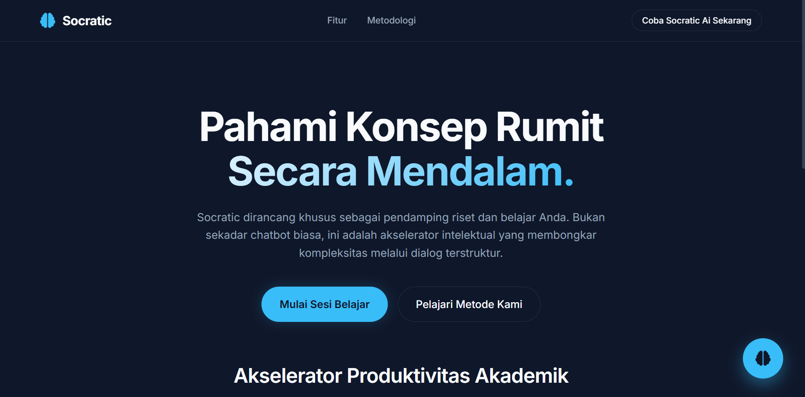

# 🧠 Socratic — AI Study & Research Companion

**Socratic** adalah asisten belajar pintar dan akselerator produktivitas akademik yang dirancang khusus sebagai pendamping riset. Socratic tidak sekadar memberikan jawaban instan, melainkan membantu pengguna memahami konsep rumit secara mendalam, membedah jurnal, dan menyusun kerangka tulisan melalui dialog terstruktur dan *Feynman Technique*.

---

## 📸 Tampilan Aplikasi



---

## ✨ Fitur Utama

- 🧠 **Socratic AI Tutor**: Asisten AI canggih yang bertindak sebagai tutor akademik. Merespons dengan bahasa baku, profesional, dan menggunakan logika akademis.
- 🔍 **Metodologi Socratic & Feynman**: Memandu pengguna untuk menguji pemahamannya sendiri dengan memecah materi abstrak menjadi komponen yang mudah dicerna melalui pertanyaan strategis.
- 🗂️ **Multi-Session Chat (LocalStorage)**: 
  - **Sesi Baru (`+`)**: Membuka ruang obrolan baru untuk topik riset yang berbeda tanpa menghapus diskusi sebelumnya.
  - **Riwayat Belajar**: Seluruh riwayat obrolan tersimpan secara lokal dan aman di dalam peramban (browser) Anda.
  - **Manajemen Riwayat (`🗑️`)**: Akses drawer riwayat untuk berpindah antar sesi diskusi atau menghapus sesi yang sudah selesai.
- 📑 **Format Output Rapi**: Mendukung integrasi Markdown, sehingga strukturisasi ide, draf esai, *bullet points*, maupun baris kode dirender dengan sangat rapi dan mudah dibaca.

---

## 🛠️ Teknologi yang Digunakan

### Frontend (`client/`)
- **HTML5 & Vanilla CSS3**: Struktur antarmuka yang modern, responsif, elegan, dan *user-friendly*.
- **JavaScript (ES6+)**: Mengelola interaksi *User Interface*, sinkronisasi *state* ke *LocalStorage*, dan komunikasi dengan API backend.
- **Library Eksternal**: 
  - *Marked.js* & *DOMPurify* untuk merender dan melakukan sanitasi pada teks Markdown.
  - *Font Awesome 6* untuk ikonografi.
  - *Google Fonts* (Inter).

### Backend (`server/`)
- **Node.js & Express.js**: REST API *server* lokal yang mengelola jalur komunikasi data.
- **Google GenAI SDK (`@google/genai`)**: Menggunakan model **Gemini** tingkat lanjut yang disematkan dengan *System Prompt* instruksi akademik khusus.
- **Multer & Dotenv**: Manajemen environment variable untuk keamanan *API Key* dan *parsing payload*.

---

## 🚀 Cara Menjalankan Proyek

### 1. Prasyarat
- [Node.js](https://nodejs.org/) (versi 18 ke atas disarankan)
- Google Gemini API Key (dapatkan dari [Google AI Studio](https://aistudio.google.com/))

---
### 2. Jalankan Backend Server
Masuk ke folder `server`, install dependensi, dan atur API key Anda:

```bash
cd server
npm install

```

### 3. Jalankan Frontend
Masuk ke folder `client`:

```bash
cd client
Gunakan Extension live preview
